### Create a QnAMaker Cognitive Service
   
- Login to [Azure Portal](https://portal.azure.com/)

- Click on Create a Resource
  
  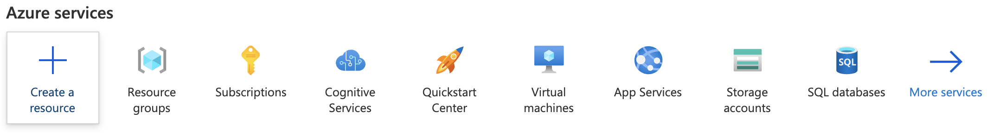

- Search for `QnA Maker`
  
  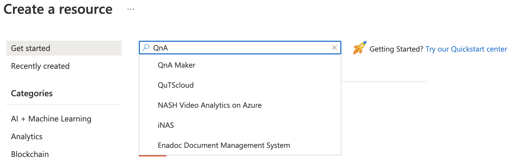

- Click on `Create`

  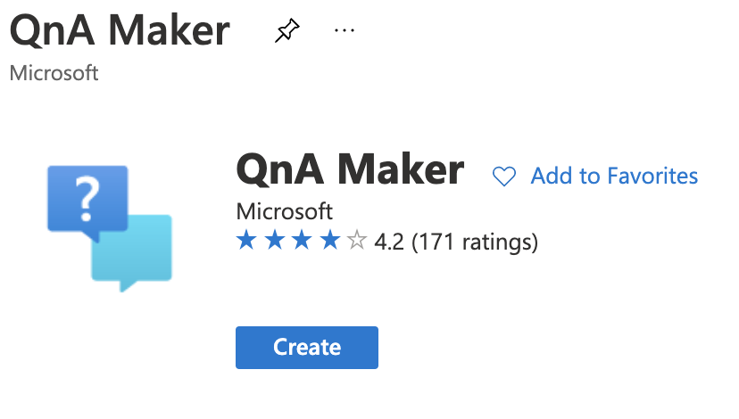

- ##### Configuring your Cognitive Service
   ###### Project Details
   - Select your subscription (it will be Azure for Students if you are using your student account)
   
     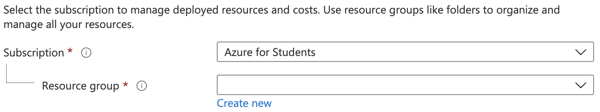

   - In Resource Group click on `Create new` and Enter the name of your service in this case the name is **`resume_bot`**

     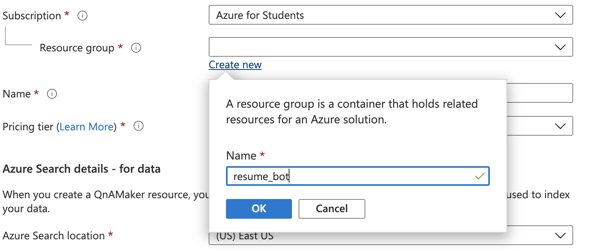

   - Select `Australia East` in Region (any other location would also work)

     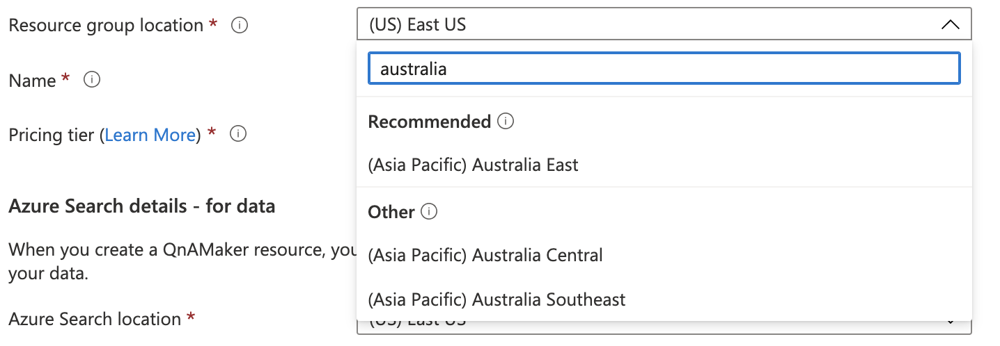

   - Type in the name you want for the service and 
     Select `Free F0` in the Pricing tier

     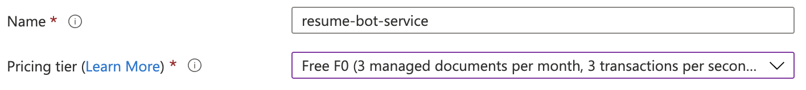

  ###### Azure Search details - for data

   - Select `Australia East` in Azure Search Location and 
     Select `Free F3` in Azure Search Pricing Tier

     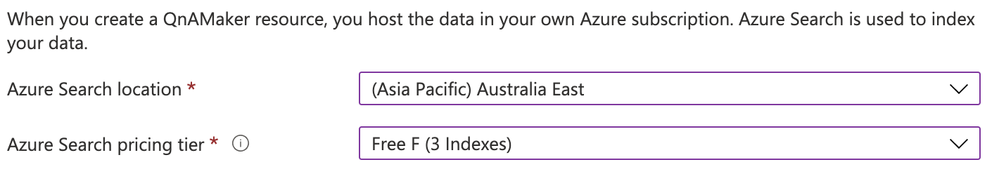

  ###### App Service details - for runtime

   - Enter you App name (e.g. `resume-bot-service`) and 
     Select `Australia East` in Website Location

     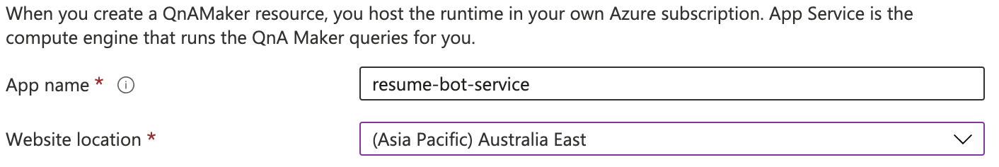

  ###### App insights details - for telemetry and chat logs
   - Disable App insights

     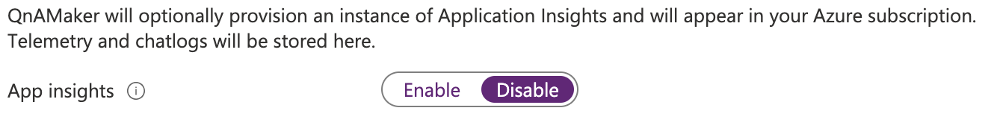

   - Click on `Review + Create`

     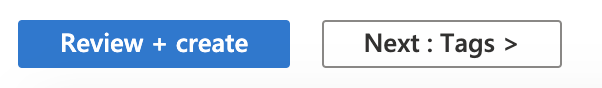

   - Verify all the contents is correct and Click on **Create** at the bottom of the screen

     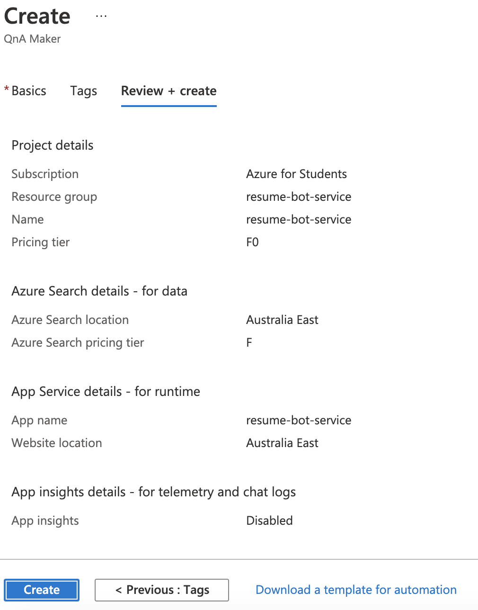
   
   - Wait for the deployment to complete

     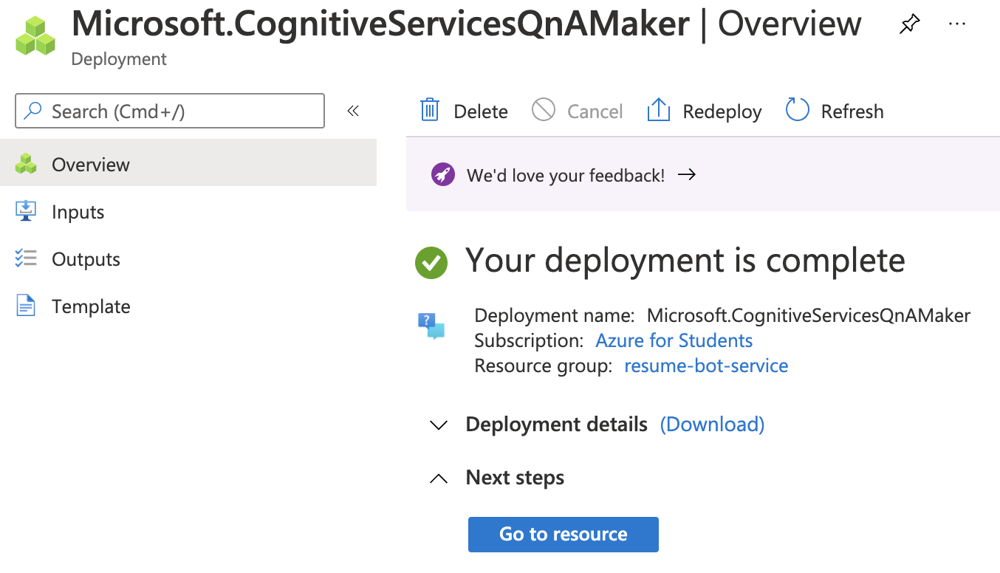

[Next: Creating a Knowledge Base](https://github.com/AUMSA/MSA_AIWorkshop_2021/blob/main/QnA%20Bot%20using%20API/2.%20Create%20a%20Knowledge%20Base.md)