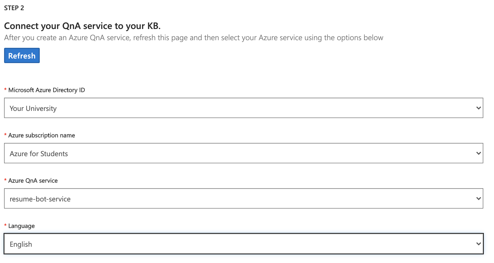

### QnA maker
   - Log into [QnA Maker](https://www.qnamaker.ai/)

     Link: [https://www.qnamaker.ai/](https://www.qnamaker.ai/)

   - Select **Create Knowledge Base**

     
    OR
     Visit Link: [https://www.qnamaker.ai/Create](https://www.qnamaker.ai/Create)

### Creating a Knowledge Base
  
   - You can skip step 1 as we have covered it Above in **Create a QnAMaker Cognitive Service**

     

   - Select your University Name in Microsoft Azure Directory ID

   - Select `Azure for Students` in the Azure subscription name

   - Select the name of the Service (in this case `resume-bot-service`)

   - Select `English` in Language
   
   - The final output of Step 2 would be 
    
     

   - Enter the Name of the Knowledge Base
    
     

   - Populating your Knowledge Base.
        - You can download the [`.docx` Click Here](resume_qna.docx)

        - Open it on your device and add more questions and answers then save the file.
        
        

        - Upload the file in Step 4 or Add a link to your uploaded file (e.g. when using Azure Blob Storage or any other service)
        
        

   - Optional To add chit chat features
    
        

   - Click on Create Knowledge Base
    
     
  
  - On the creation of the Knowledge Base you can add more Key Pair questions else you can Save your Knowledge base by clicking on the **Save and Train** button and Click on **Publish**.
   
   

  - Confirm to publish
   
    

  - You will have your endpoints displayed like this:
    
    
  
  - Click on **Curl**
  - Copy the **URL** and **End Point keys**
    

[Next: Testing the QnA API](3.\ Test\ QnA\ API.md)