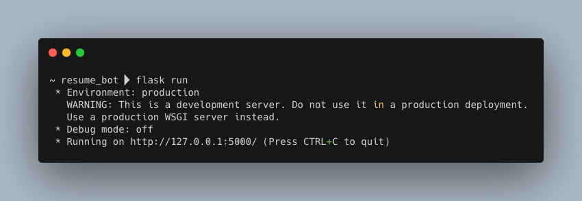
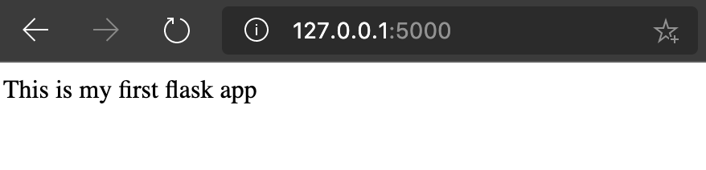
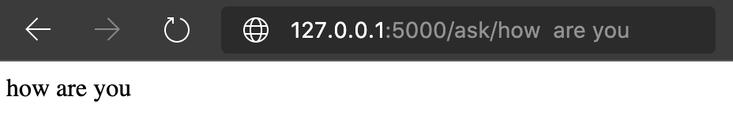
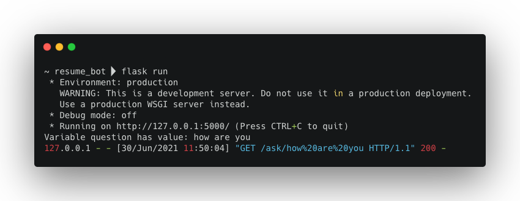
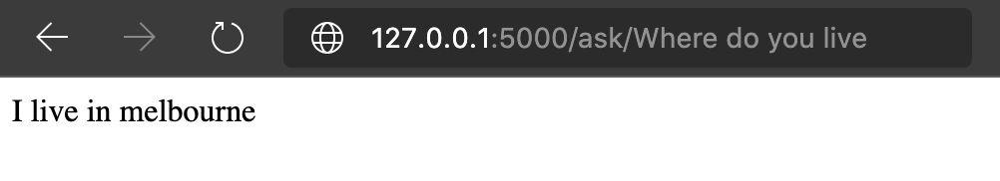

### Let us create an application

  - Create a folder `resume_bot` and once inside the folder

  - We will install [Flask](https://flask.palletsprojects.com/en/2.0.x/) and `requests`
    ```
    pip install -U Flask
    pip install requests
    ```
  
    - To make this step  
      - We will create a file named `requirements.txt`
      - Write
        ```
        Flask
        requests
        ```
      - Check [example file](resume_bot/requirements.txt)
    
  - Create a simple flask template
    - Create a file `app.py`
    - Add the following lines of code
      ```
      from flask import Flask

      app = Flask(__name__)

      @app.route("/")
      def hello():
          return "This is my first flask app"
      ```
    - Let us run the app by typing the following commands on terminal
      ```
      flask run
      ```
      The Output would be something like this:
      
    - Open your browser and enter the address as shown on your terminal (in this case `http://127.0.0.1:5000/`)

    - You will see this in your browser
      

  - Now let us integrate the `ask` function into the website (i.e. `app.py`)
    - We first create a route 
      ```
      @app.route("/ask/<text>")
      ```
      - This means on you go to `http://127.0.0.1:5000/ask/how are you`
      a variable named `text` will have the value `"how are you"`

      - Let us try this
        ```
        from flask import Flask
        app = Flask(__name__)

        @app.route("/")
        def hello():
            return "This is my first flask app"

        @app.route("/ask/<text>")
        def ask(text):
            print(f"Variable text has value: { text }")
            return text
        ```
      
      - Now when you enter `http://127.0.0.1:5000/ask/how are you` the website will have the following content:
        
      
        And your terminal will show 

        

    - Now we will add the `ask` function created when using the QnA API 
      - Import packages required for sending requests to QnA Service
        ```
        import requests
        import json
        ```
      - Also add variables `url` and `end_point`
      ```
      url = '<your-url>'
      end_point = '<your-endpoint>'
      ```
      - Since `url` and `end_point` are global variables we will not need to pass them into the function
      - The code will now look something like this:
        ```
        from flask import Flask
        import requests
        import json

        app = Flask(__name__)

        url = '<your-url>'
        end_point = '<your-endpoint>'

        @app.route("/")
        def hello():
          return "This is my first flask app"

        @app.route("/ask/<text>")
        def ask(text):
          headers = {
              'Authorization': 'EndpointKey ' + str(end_point).strip(),
              'Content-type': 'application/json',
          }

          data = """{'question':'"""+text+"""'}"""

          response = requests.post(
                          str(url).strip(), 
                          headers=headers, 
                          data=data
                      )
          information = json.loads(response.text)
          return information['answers'][0]['answer']
        ```
      - Let us try it:
        

  - Let us now build a website for the app
    - We will create a folder `templates` and `static`
    - In the folder `templates` we will create 
      - A HTML file `index.html`

    - In the folder `static` we will create
      - A CSS file `style.css`
      - A JavaScript file `script.js`

    - The folder structure would be something like this:
      ```
      resume_bot
        ┣ static
        ┃ ┣ script.js
        ┃ ┗ style.css
        ┣ templates
        ┃ ┗ index.html
        ┣ app.py
        ┗ requirements.txt
      ```
    - We will be using [Bootstrap](https://getbootstrap.com/) to create a responsive webpage. [Click Here to Learn More](https://docs.microsoft.com/en-us/archive/msdn-magazine/2015/june/web-development-building-responsive-web-sites-with-bootstrap)

    - In `index.html` we will create the basic view
      ```
      <!DOCTYPE html>
      <html lang="en">
      <head>
          <meta charset="UTF-8">
          <meta http-equiv="X-UA-Compatible" content="IE=edge">
          <meta name="viewport" content="width=device-width, initial-scale=1.0">
          <title>Resume Bot</title>

          <!-- Bootstrap  -->
          <link href="https://cdn.jsdelivr.net/npm/bootstrap@5.0.2/dist/css/bootstrap.min.css" rel="stylesheet">

          <!-- Importing CSS and JavaScript Files -->
          <link href="{{url_for('static', filename = 'style.css')}}" rel="stylesheet">
          <script src="{{url_for('static', filename = 'script.js')}}"></script>
          
      </head>
      <body>
          <div class="row">
              <div class="container chat-box" id="chat">

              </div>
          </div>
          <div class="row">
              <div class="container chat-text">
                  <div class="input-group mb-3">
                      <input type="text" class="form-control" placeholder="Ask me a question" id="question">
                      <button class="btn btn-primary" type="button" onclick="request_server()">Ask !</button>
                  </div>
              </div>
          </div>
      </body>
      </html>
      ```
    
    - Render the template in the app
      - Open `app.py`
      - replace first line `from flask import Flask` with `from flask import Flask, render_template`
      - In Function `hello()` replace the `return "This is my first flask app"` statement with `return render_template('index.html')`

    - Let us add some style to the app, add the following content in `style.css`
      ```
      .chat-box{
          height: 90vh;
          overflow-y: scroll;
      }

      .chat-text{
          height: 10vh;
      }
      ```

    - Now let us make a script to request our local server. In `script.js` add the following content
      ```
      function request_server(){
        var question = document.getElementById('question').value;
        if (question !== ""){

            // Sending a Request
            var host = window.location.host;
            var xmlHttp = new XMLHttpRequest();
            xmlHttp.open("GET", "http://"+host+"/ask/" + question, false);
            xmlHttp.send(null);
            var response = xmlHttp.responseText;

            // Adding the content to the chat
            var prev = document.getElementById('chat').innerHTML;
            var new_message = `
                <div class="alert alert-success">
                    ` + question + `
                </div>
                <div class="alert alert-secondary">
                    ` + response + `
                </div>
                
            `;

            document.getElementById('question').value = "";
            document.getElementById('chat').innerHTML = prev + new_message;
        }
      }
      ```
      
  - Now start/restart the flask server
  - If you server was on press <kbd>CTRL</kbd> + <kbd>C</kbd>
  - ##### Note: At times updates are not shown immediately due to browser cache, try using a different browser

[Next: Deploying App on Azure](https://github.com/AUMSA/MSA_AIWorkshop_2021/blob/main/QnA%20Bot%20using%20API/5.%20Deploying%20on%20Azure%20App%20Service.md)