### Finally let's deploy the application on Azure App Service

  - You will need [Visual Studio Code](https://code.visualstudio.com/) for this. [Download Here](https://code.visualstudio.com/Download)

  - In Extensions search for Azure App Service and Install the extension
    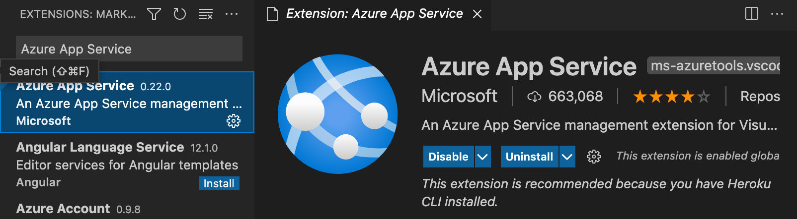

    If you are unable to find the extension [Click here](https://marketplace.visualstudio.com/items?itemName=ms-azuretools.vscode-azureappservice)

  - In Visual Studio Code click on Azure on the left toolbar
     

  - Sign In to your account

  - Click on "Create New Web App"
    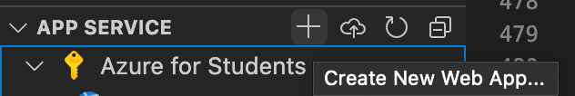

  - Give the app a name
    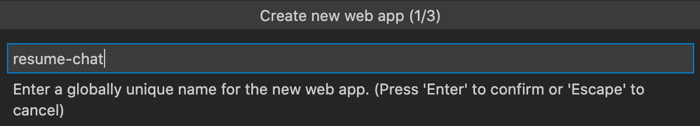

  - Select `Python 3.7`
    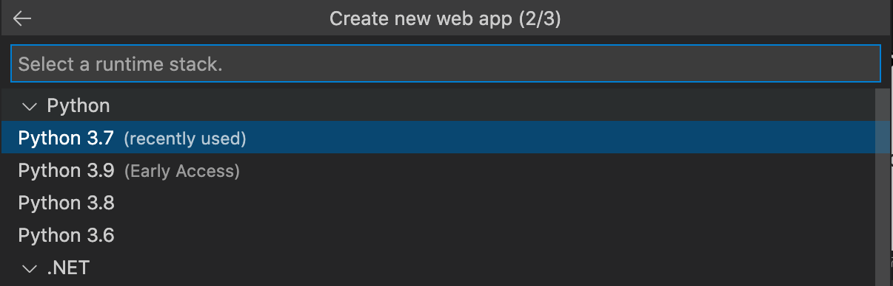

  - Select `Free F1` Tier
    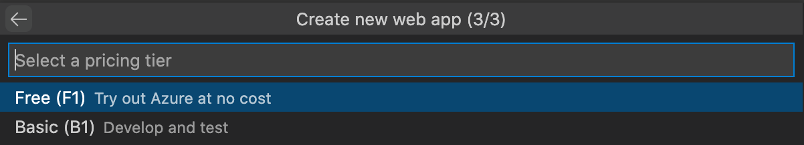
  
  - Right-click on the service you just created and select **Open in portal**
    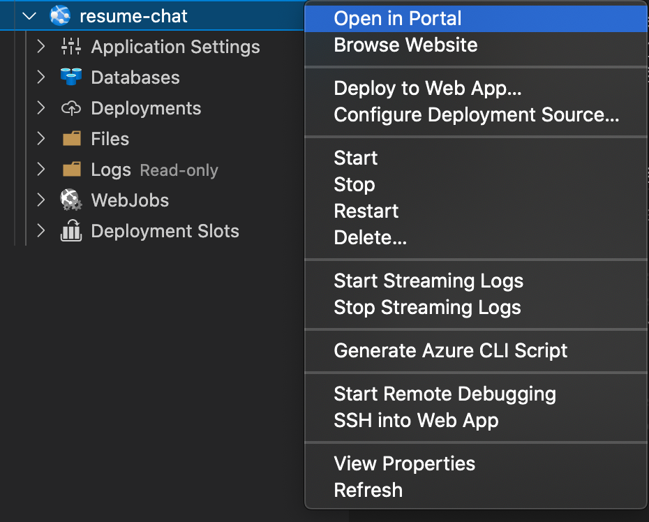

  - Your browser will be redirected to the Azure portal with the app service. Click on **Configuration**
    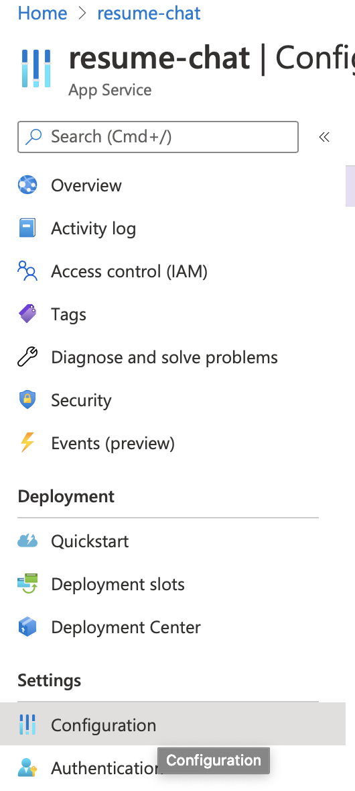
  
  - Click on **General settings**
    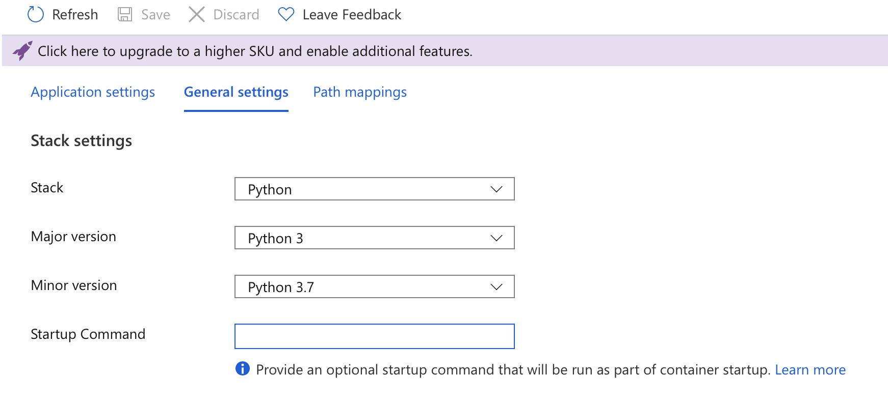

  - In **Startup Command** Type the following lines
    ```
    gunicorn --bind=0.0.0.0 app:app
    ```
    It should look like this
    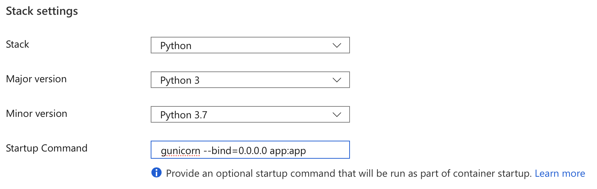

  - Click on **Save**

  - On your Visual Studio Code right click on the App you just created and click on **Deploy to Web App**
    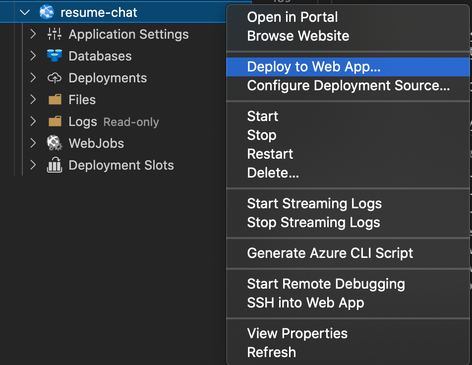

  - Browse the folder which contains the code base for the application
    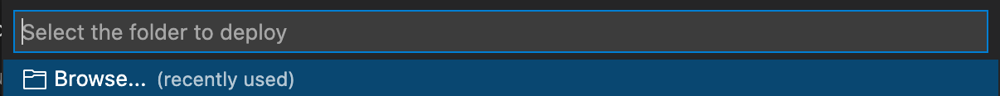

  - Wait for the app to deploy
    - You can see it work by opening the terminal
    - Select **OUTPUT**
    - On the drop-down towards the right side of the toolbar select **Azure App Service**

      

      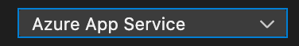

    - You will be able to see the URL for your application
      `<app-service-name>.azurewebsites.net`
    
    - You can see when the deployment completes

  - Finally, visit `<app-service-name>.azurewebsites.net` to see your application and share it with others.