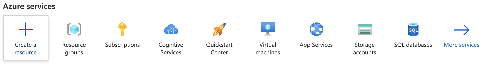
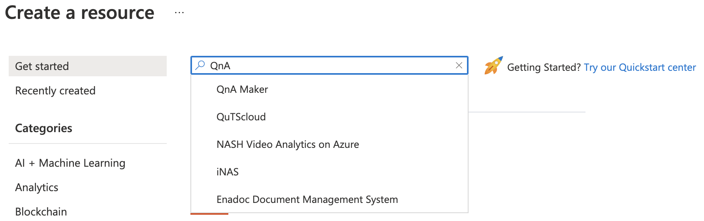
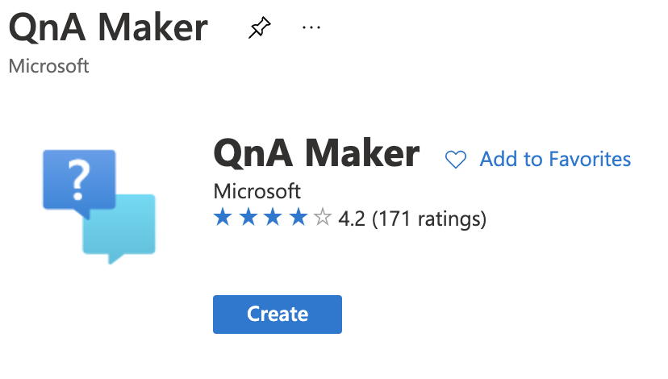
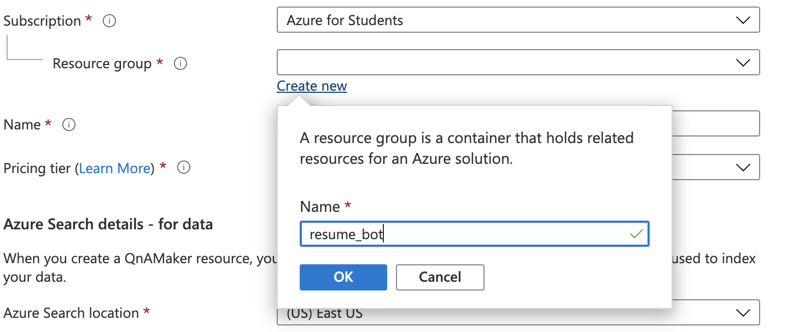
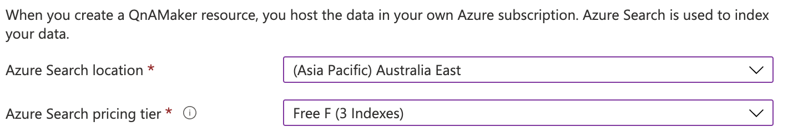
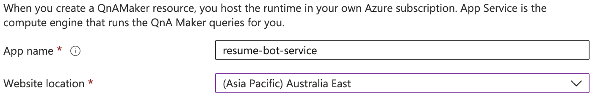
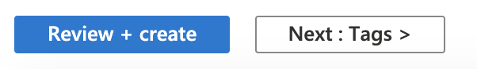
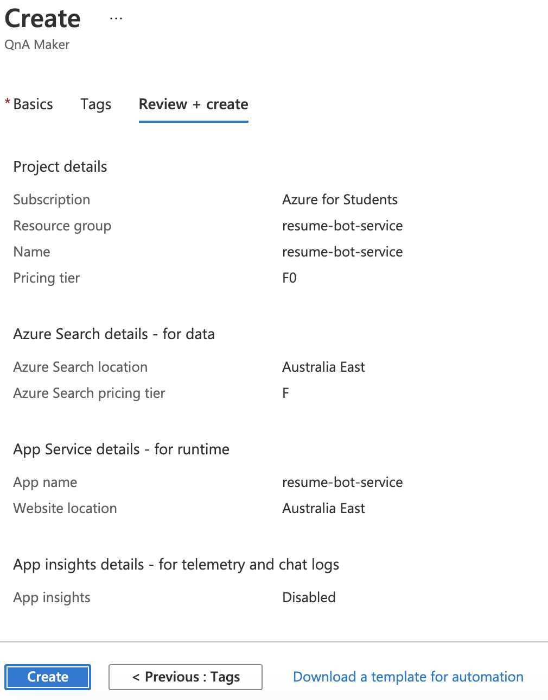
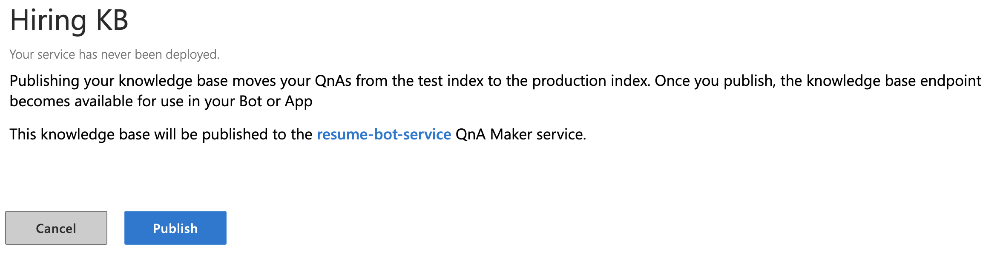

# How to create your own Resume Bot

Please Note to use your **student account** for the rest of the process as you will need credits to increase the limitations.

### Get Free Credits
   Signup for [Azure Students Credits](https://azure.microsoft.com/en-au/free/students/) as this project will require a few credits.

   You can signup here [https://azure.microsoft.com/en-au/free/students/](https://azure.microsoft.com/en-au/free/students/)


### Create a QnAMaker Cognitive Service
   
- Login to [Azure Portal](https://portal.azure.com/)

- Click on Create a Resource
     

- Search for `QnA Maker`
     

- Click on `Create`
     

- ##### Configuring your Cognitive Service
   ###### Project Details
   - Select your subscription (it will be Azure for Students if you are using your student account)
     

   - In Resource Group click on `Create new` and Enter the name of your service in this case the name is **`resume_bot`**
     

   - Select `Australia East` in Region (any other location would also work)
     

   - Type in the name you want for the service and 
     Select `Free F0` in Pricing tier
     

  ###### Azure Search details - for data

   - Select `Australia East` in Azure Search Location and 
     Select `Free F3` in Azure Search Pricing Tier
     

  ###### App Service details - for runtime

   - Enter you App name (e.g. `resume-bot-service`) and 
     Select `Australia East` in Website Location
     


  ###### App insights details - for telemetry and chat logs
   - Disable App insights
     

   - Click on `Review + Create`
     

   - Verify all the contents is correct and Click on **Create** on the bottom of the screen
     
   
   - Wait for the deployment to complete
     

### QnA maker
   - Log into [QnA Maker](https://www.qnamaker.ai/)
     Link: [https://www.qnamaker.ai/](https://www.qnamaker.ai/)

   - Select **Create Knowledge Base**
     
    OR
     Visit Link: [https://www.qnamaker.ai/Create](https://www.qnamaker.ai/Create)


### Creating a Knowledge Base
  
   - You can skip step 1 as we have covered it Above in **Create a QnAMaker Cognitive Service**
     

   - Select your University Name in Microsoft Azure Directory ID

   - Select `Azure for Students` in Azure subscription name

   - Select the name of the Service (in this case `resume-bot-service`)

   - Select `English` in Language
   
   - The final output of Step 2 would be 
   

   - Enter the Name of the Knowledge Base
   

   - Populating your Knowledge Base.
        - You can download the [`.docx` Click Here](resume_qna.docx)

        - Open it on your device and add more question and answers then save the file.
        

        - Upload the file in Step 4 or Add a link to your uploaded file (e.g. when using Azure Blob Storage or any other service)
        

   - Optional To add chit chat features
    

   - Click on Create Knowledge Base
    
  
  - On creation of the Knowledge Base you can add more Key Pair questions else you can Save your Knowledge base by clicking on the **Save and Train** button and Click on **Publish**.
   

  - Confirm to publish
    

  - You will have your endpoints displayed like this:
    
    Click on **Curl**
  
  - Click on **Curl**
  - Copy the **URL** and **End Point keys**
    

### Testing your API

  - Install Python 3.x you can follow the [guid here](https://docs.python.org/3/using/windows.html)

  - Start python inOpen your command prompt / terminal and type
    ```
    python
    ```
  
  - First we will import the packages required for this
    ```
    import requests
    import json
    ```
  
  - Save the copied **URL** and **End Point key** in a variable `url` and `end_point`
    ```
    url = '<your-url>'
    end_point = '<your-endpoint>'
    ```

  - Lets create a header, you can check a [list of headers here](https://docs.microsoft.com/en-us/partner/develop/headers)

    ```
    headers = {
	    'Authorization': 'EndpointKey ' + str(end_point).strip(),
	    'Content-type': 'application/json',
      }
    ```
  
  - Add your question
    ```
    text = "Where do you live ?"
    ```
  
  - Let us convert the text into the format that the API requires 
    ```
    data = """{'question':'"""+text+"""'}"""
    ```

  - Now we will send a request to the service
    ```
    response = requests.post(
                  str(url).strip(), 
                  headers=headers, data=data
                )
    ```
  
  - Let us view the response by typing
    ```
    response.text
    ```
    The Output would be something like this: 
    ```
    '{
      "answers":[{
        "questions":["Where do you live"],
        "answer":"I live in melbourne",
        "score":100.0,
        "id":3,
        "source":"your_file",
        "isDocumentText":false,
        "metadata":[],
        "context":{
          "isContextOnly":false,
          "prompts":[]
        }
      }],
      "activeLearningEnabled":false
    }'
    ```
  
  - Since we only need the `"I live in melbourne"` part we have to 
    - Convert the string to a `JSON` [Click here to learn more](https://techcommunity.microsoft.com/t5/microsoft-365-pnp-blog/introduction-to-json/ba-p/2049369)
      ```
      information = json.loads(response.text)
      ```
    - Now we select the required key as in a dictionary in python
      ```
      information['answers'][0]['answer']
      ```
    - The output would be something like this:
      ```
      'I live in melbourne'
      ```

  - We can convert the whole process into a function:
    ```
    def ask(url, end_point, text):
      headers = {
          'Authorization': 'EndpointKey ' + str(end_point).strip(),
          'Content-type': 'application/json',
      }

      data = """{'question':'"""+text+"""'}"""

      response = requests.post(
                          str(url).strip(), 
                          headers=headers, 
                          data=data
                        )

      information = json.loads(response.text)
      return information['answers'][0]['answer']
    ```
  
  - Lets check if the function works:
    ```
    ask("your-url", "your-endpoint", "Where do you live")
    >> 'I live in melbourne'
    ```
